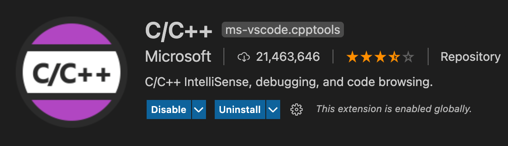
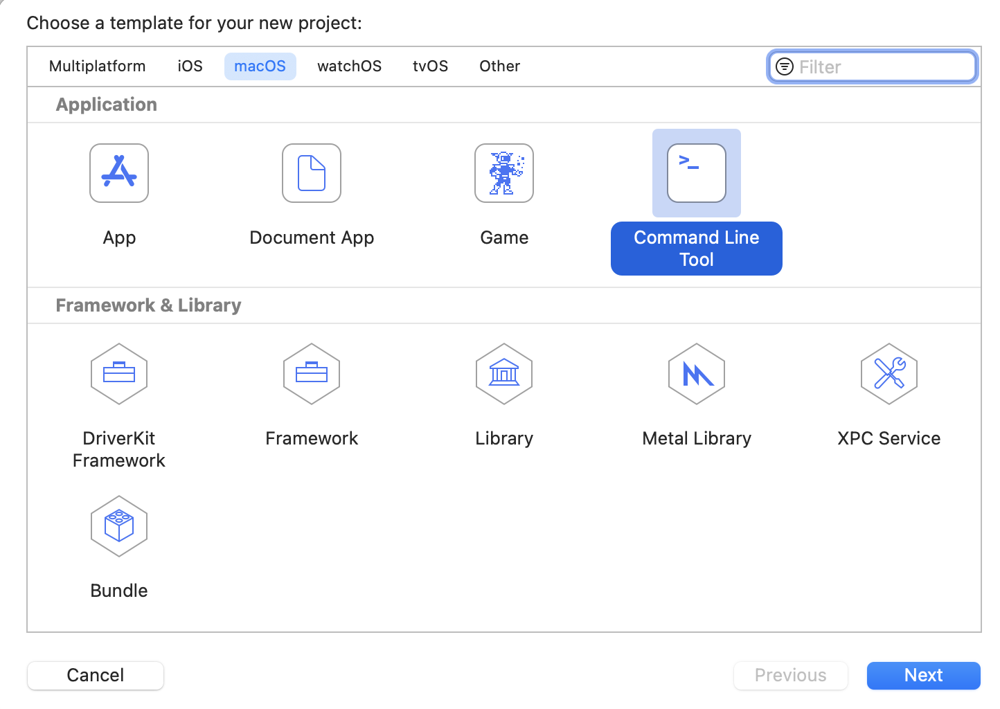
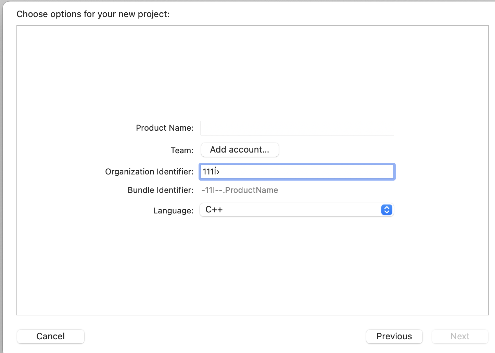
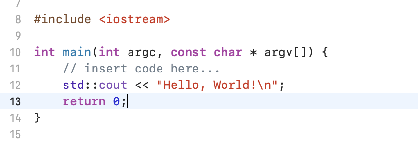

# C++开发环境搭建
* 代码编辑神器 vscode  
1、安装拓展  
mac自带已经有c的编译器了所以不用另外安装，终端g++/gcc --version可以查看相关信息，如果没有可以顺便安装xcode，省去一些麻烦，也可以用来写c++代码。vscode只需要把c/c++相关的一些工具安装下来  
C/C++  

C/C++ Clang Command Adapter  
C/C++ Extension Pack 
C++ Intellisense  
C/C++ Runner  
2、新建一个.cpp文件  
“command+shift+p”打开命令行工具窗口，输入或者选择“Edit Configurations”命令，生成c_cpp_properties.json文件  
也可以直接复制下面四个个文件到.vscode文件夹下  
c_cpp_properties.json:includepath路径下可以根据自己需要配置  
```
{
  "configurations": [
    {
      "name": "macos-gcc-x64",
      "includePath": [
        "${workspaceFolder}/**"
      ],
      "compilerPath": "/usr/bin/clang",
      "cStandard": "${default}",
      "cppStandard": "c++11",
      "intelliSenseMode": "macos-gcc-x64",
      "compilerArgs": [
        "-Wall",
        "-Wextra",
        "-Wpedantic",
        "-stdlib=libc++",
        "-std=c++11"
      ]
    }
  ],
  "version": 4
}
```
task.json
```
{
    "tasks": [
        {
            "type": "cppbuild",
            "label": "C/C++: g++ 生成活动文件",
            "command": "/usr/bin/g++",
            "args": [
                "-std=c++11",
                "-g",
                "${file}",
                "-stdlib=libc++",
                "-std=c++11",
                "-o",
                "${fileDirname}/${fileBasenameNoExtension}"
            ],
            "options": {
                "cwd": "${fileDirname}"
            },
            "problemMatcher": [
                "$gcc"
            ],
            "group": "build",
            "detail": "调试器生成的任务。"
        },
        {
            "type": "cppbuild",
            "label": "C/C++: g++ 生成活动文件 ver(1)",
            "command": "/usr/bin/g++",
            "args": [
                "-g",
                "${file}",
                "-stdlib=libc++",
                "-std=c++11",
                "-o",
                "${fileDirname}/${fileBasenameNoExtension}",
                "-Wall",
                "-Wextra",
                "-Wpedantic"
            ],
            "options": {
                "cwd": "${fileDirname}"
            },
            "problemMatcher": [
                "$gcc"
            ],
            "group": "build",
            "detail": "调试器生成的任务。"
        },
        {
            "type": "cppbuild",
            "label": "C/C++: g++ 生成活动文件 ver(2)",
            "command": "/usr/bin/g++",
            "args": [
                "-g",
                "${file}",
                "-o",
                "${fileDirname}/${fileBasenameNoExtension}",
                "-Wall",
                "-Wextra",
                "-Wpedantic",
                "-stdlib=libc++",
                "-std=c++11"
            ],
            "options": {
                "cwd": "${fileDirname}"
            },
            "problemMatcher": [
                "$gcc"
            ],
            "group": {
                "kind": "build",
                "isDefault": true
            },
            "detail": "调试器生成的任务。"
        }
    ],
    "version": "2.0.0"
}
```
setting.json
```
{
  "C_Cpp_Runner.warnings": [
    "-Wall",
    "-Wextra",
    "-Wpedantic"
  ],
  "C_Cpp_Runner.compilerArgs": [
    "-stdlib=libc++",
    "-std=c++11"
  ],
  "C_Cpp_Runner.includePaths": [],
  "C_Cpp_Runner.linkerArgs": [],
  "C_Cpp_Runner.cStandard": "",
  "C_Cpp_Runner.cppStandard": "c++11",
  "C_Cpp_Runner.excludeSearch": [],
  "C_Cpp_Runner.enableWarnings": true,
  "C_Cpp_Runner.warningsAsError": false,
  "C_Cpp_Runner.cppCompilerPath": "/usr/bin/clang++",
  "code-runner.executorMap": {
    "javascript": "node",
    "java": "cd $dir && javac $fileName && java $fileNameWithoutExt",
    "c": "cd $dir && gcc $fileName -o $fileNameWithoutExt && $dir$fileNameWithoutExt",
    "cpp": "cd $dir && g++ $fileName -std=c++11 -o $fileNameWithoutExt && $dir$fileNameWithoutExt",
    "objective-c": "cd $dir && gcc -framework Cocoa $fileName -o $fileNameWithoutExt && $dir$fileNameWithoutExt",
    "php": "php",
    "python": "python -u",
    "perl": "perl",
    "perl6": "perl6",
    "ruby": "ruby",
    "go": "go run",
    "lua": "lua",
    "groovy": "groovy",
    "powershell": "powershell -ExecutionPolicy ByPass -File",
    "bat": "cmd /c",
    "shellscript": "bash",
    "fsharp": "fsi",
    "csharp": "scriptcs",
    "vbscript": "cscript //Nologo",
    "typescript": "ts-node",
    "coffeescript": "coffee",
    "scala": "scala",
    "swift": "swift",
    "julia": "julia",
    "crystal": "crystal",
    "ocaml": "ocaml",
    "r": "Rscript",
    "applescript": "osascript",
    "clojure": "lein exec",
    "haxe": "haxe --cwd $dirWithoutTrailingSlash --run $fileNameWithoutExt",
    "rust": "cd $dir && rustc $fileName && $dir$fileNameWithoutExt",
    "racket": "racket",
    "scheme": "csi -script",
    "ahk": "autohotkey",
    "autoit": "autoit3",
    "dart": "dart",
    "pascal": "cd $dir && fpc $fileName && $dir$fileNameWithoutExt",
    "d": "cd $dir && dmd $fileName && $dir$fileNameWithoutExt",
    "haskell": "runhaskell",
    "nim": "nim compile --verbosity:0 --hints:off --run",
    "lisp": "sbcl --script",
    "kit": "kitc --run",
    "v": "v run",
    "sass": "sass --style expanded",
    "scss": "scss --style expanded",
    "less": "cd $dir && lessc $fileName $fileNameWithoutExt.css",
    "FortranFreeForm": "cd $dir && gfortran $fileName -o $fileNameWithoutExt && $dir$fileNameWithoutExt",
    "fortran-modern": "cd $dir && gfortran $fileName -o $fileNameWithoutExt && $dir$fileNameWithoutExt",
    "fortran_fixed-form": "cd $dir && gfortran $fileName -o $fileNameWithoutExt && $dir$fileNameWithoutExt",
    "fortran": "cd $dir && gfortran $fileName -o $fileNameWithoutExt && $dir$fileNameWithoutExt"
  },
  "C_Cpp_Runner.cCompilerPath": "/usr/bin/clang",
  "C_Cpp_Runner.debuggerPath": "/usr/bin/lldb",
  "C_Cpp_Runner.makePath": "/usr/bin/make"
}
```
lauch.json
```
{
  "configurations": [
    {
      "name": "(lldb) 启动",
      "type": "cppdbg",
      "request": "launch",
      "program": "输入程序名称，例如 ${workspaceFolder}/test",
      "args": [],
      "stopAtEntry": false,
      "cwd": "${fileDirname}",
      "environment": [],
      "externalConsole": false,
      "MIMode": "lldb"
    },
    {
      "name": "C/C++ Runner: Debug Session",
      "type": "cppdbg",
      "request": "launch",
      "args": [],
      "stopAtEntry": false,
      "cwd": "/Users/weizhifeng/note",
      "environment": [],
      "program": "/Users/weizhifeng/note/build/Debug/outDebug",
      "internalConsoleOptions": "openOnSessionStart",
      "MIMode": "lldb",
      "miDebuggerPath": "/usr/bin/lldb",
      "externalConsole": false
    }
  ]
}
```
至此，vscode应该就可以运行c++代码了

* 终端  
c++开发少不了和终端打交道，可参考[mac终端美化](MacOS终端美化.md)进行配置

* xcode  
苹果官方也提供了一个集成开发环境xcode，appstore可以安装--免费  
打开xcode，选择command line tool

选择cpp语言

然后就可以在项目里编译和运行c++代码了
