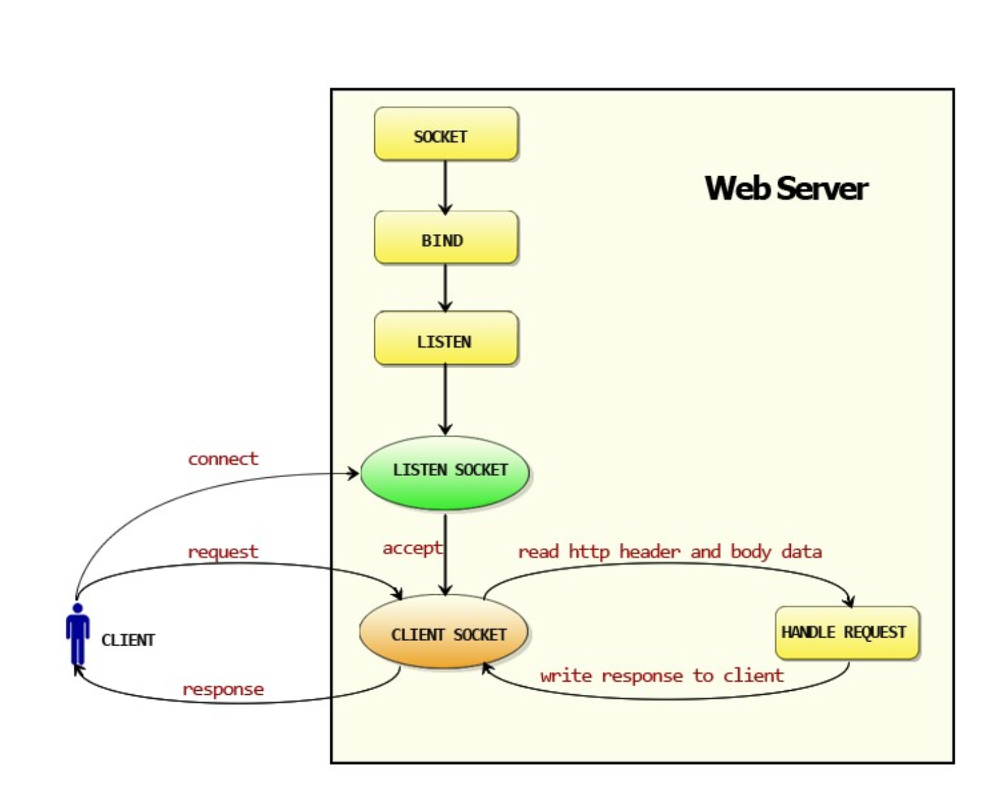

# web服务器（Go版）

基础包： net/http，log

go的http包运行流程：



------

基本api：

​	注册路由：http.HandleFunc("/", HelloServer) --"/"是请求路径，调用hellpserver函数

​	启动服务器并监听端口： err := http.ListenAndServe(":8080", nil)  --返回值是error,启动server并bind到127.0.0.0:8080上

​	解析参数：requset.phase()--用于解析参数，默认不解析

​					  fmt.Println(r.Form)
​					  fmt.Println(r.URL.Path)

​	构造回复报文：fmt.Fprintf(w, "Hello client!") 

​	设置状态码：w.WriteHeader(401) 

​	设置响应头：w.Header().Set("Location", "https://xxx.com")   

​							w.WriteHeader(301)

报文解析：

​	http报文分为 状态行 响应头 响应主体

​	客户端的请求信息都封装到了request对象中了，调用路由时会将http.request传给函数；ResponseWriter用来创建回复http的响应

​		--func HelloServer(w http.ResponseWriter, r *http.Request){} --一个路由函数

​	获取host：r.Host

​	获取浏览器信息：r.UserAgent()

日志打印：

​	log.fatal("ListenAndServe:",err) :完成的功能：完成打印，退出程序

​	log.println():打印日志

------

#### 数据库： 

使用：go get github.com/go-sql-driver/mysql ；下载开源驱动模块

1、引入驱动包

​	_ "github.com/go-sql-driver/mysql" //_表示引入后面的包名而不直接使用这个包中定义的函数，变量等资源

​	"database/sql"

2、sql.Open()用来打开一个数据库驱动

```go
db, err := sql.Open("mysql", "astaxie:astaxie@/test?charset=utf8")
//第一个参数 数据库类型 第二个参数：用户名:密码@tcp(IP:端口)/数据库?charset=utf8
//db, err := sql.Open("mysql", "root:111111@tcp(127.0.0.1:3306)/test?charset=utf8")
//还有其他格式
```

3、db.Prepare()函数用来返回准备要执行的 sql 操作，然后返回准备完毕的执行状态。

​	 db.Query()函数用来直接执行 Sql 返回 Rows 结果。

​	 stmt.Exec()函数用来执行 stmt 准备好的 SQL 语句

#### Nosql 数据库


